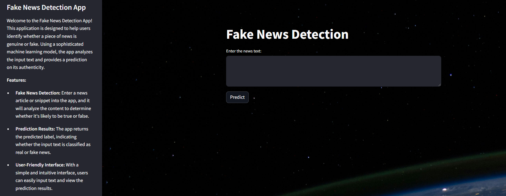

# End-to-End Fake News Detection App with Streamlit and FastAPI



This application combines FastAPI and Streamlit to provide a user-friendly interface for detecting fake news using a machine learning model trained on Passive-Aggressive Classifier.

Dataset: [Kaggle](https://www.kaggle.com/datasets/clmentbisaillon/fake-and-real-news-dataset)

## Features

- **FastAPI Backend**: The backend is built using FastAPI, a modern, fast (high-performance), web framework for building APIs with Python 3.7+ based on standard Python type hints.
- **Streamlit Frontend**: The frontend is created using Streamlit, an open-source Python library that makes it easy to create and share beautiful, custom web apps for machine learning and data science.
- **Fake News Detection Model**: The application uses a machine learning model trained on a dataset of news articles to differentiate between authentic and fraudulent news articles.
- **Preprocessing**: Text data is preprocessed before feeding it into the model, including steps like converting text to lowercase, removing punctuation, tokenization, removing stopwords, and lemmatization.
- **TF-IDF Feature Extraction**: The text data is vectorized using TF-IDF (Term Frequency-Inverse Document Frequency) vectorization, which converts text data into numerical features suitable for machine learning models.
- **Passive-Aggressive Classifier**: The machine learning model used for classification is the Passive-Aggressive Classifier, a linear classification algorithm well-suited for online learning and large-scale text classification tasks.
- **API Endpoint**: The FastAPI backend provides an API endpoint `/predict` that accepts text data and returns the predicted label (Fake or Real) based on the input text.
- **User Interface**: The Streamlit frontend allows users to input text data and see the predicted label (Fake or Real) based on the machine learning model's classification.

## Installation and Setup

1. **Clone the Repository**:
   ```bash
   git clone https://github.com/mfarooq0001/fake-new-detection-app-using-streamlit-and-fastapi
   cd fake-news-detection

2. **Create virtual environment**:
	```bash
	'python -m venv venv'

3. **Activate the Virtual Environment**:
	- On Windows:
		```bash
		venv/Scripts/activate
	- On macOS and Linux:
		```bash
		source venv/bin/activate

4. **Install Dependencies**:
	```bash
	pip install -r requirements.txt

5. **Run the FastAPI Backend**:
	```bash
	cd fastapi_backend
	uvicorn api:app --reload
	
6. **Run the Streamlit Frontend**	
	```bash
	streamlit run app.py 
